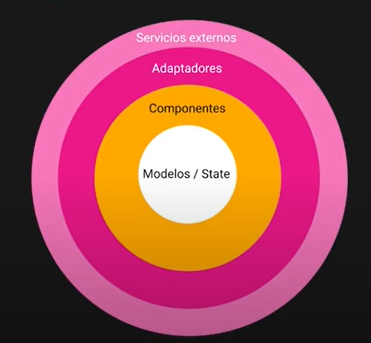
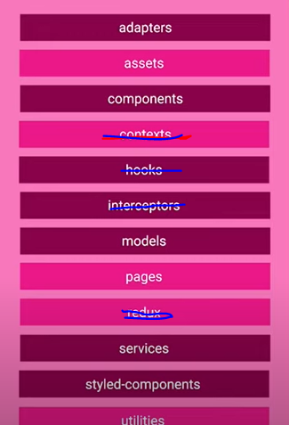
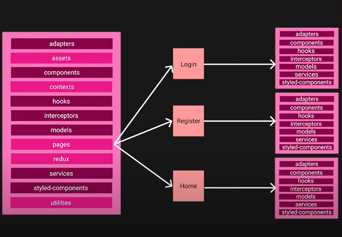
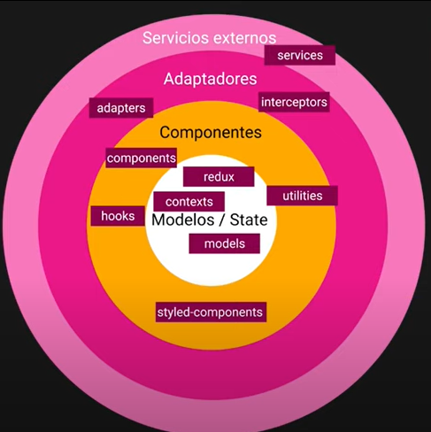
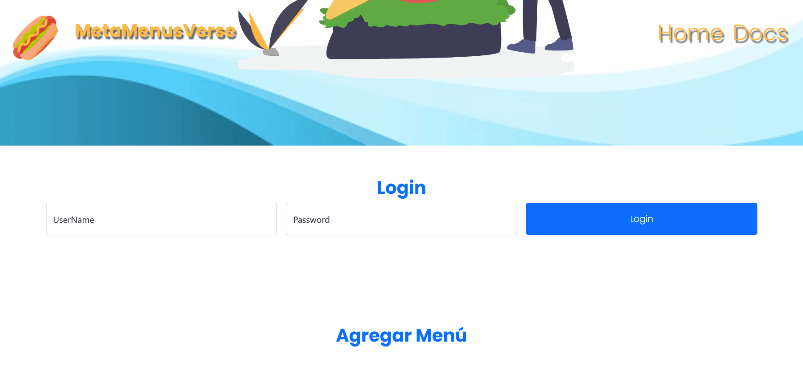
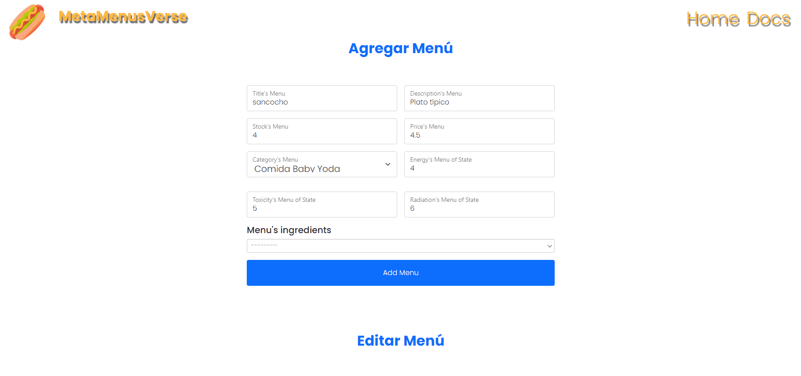

# MetaMenusVerse-Frontend

This project is related to DAWEC assignature, which is created a Client-side app for Backend Node Express App, this app will use the concepts learned through the last 3 months related to DOM, BOM, Events, APIs JS Browser, etc


<br>


<br>

## Tabla de Contenidos

1. [Instalación y uso](#instalacion-y-uso)
2. [Tecnologías Usadas](#tecnologias-usadas)
3. [Arquitectura de la aplicación](#arquitectura-de-la-aplicación)
4. [Empaquetador ViteJS](#empaquetador-vitejs)
5. [Historias de Usuarios](#historias-de-usuarios)
6. [Bibliografía](#bibliografía)
7. [Licencia](#licencia)


---

## Instalación y uso

1. Clonar el proyecto

```
git clone https://<putYourTokenGit>@github.com/MateoGarciaG/MetaMenusVerse-Frontend
```

2. Accede al directorio clonado e instala las dependencias
```
npm i 
```

3. Ejecuta la APP en modo development
```
npm run dev
```

4. Realiza el build y Ejecuta la APP en modo Production
```
npm run prod
```

5. Ejecuta el linter
```
npm run  lint
```

6. Ejecuta el linter y fuerza para formatear el código
```
npm run lint:fix
```

7. Ejecutar el formatter Prettier
```
npm run format
```

8. Para ejecutar el modo WATCH
```
npm run watch
```


**[⬆ back to top](#tabla-de-contenidos)**


---

## Tecnologías Usadas

- JS
- NPM
- Visual Studio Code
- Git
- ViteJS
- HTML Lit from Lit Elements
- Eslint with Prettier
- SASS
- Bootstrap
- vanilla-prop-types


**[⬆ back to top](#tabla-de-contenidos)**


---

## Arquitectura de la aplicación

`Imagenes pertenecientes al canal de Youtube @GentlemanProgramming`

En mi busqueda por aplicar una arquitectura para frontend de la cual no dependiera de un framework o de la estructura que ya te proponen algunos donde muchas veces es poco escalable debido a la dependencia entre capas y modulos, tuve la duda de como y cuanto es viable sería aplicar los conceptos de clean architecture, ya que sí bien es utilizado en su mayoría para arquitecturas en el lado backend, porque no sería viable aplicarlo en el lado frontend, y precisamente en el curso de React que he estado haciendo se toco está temática (Los recursos del curso de React del cual mencionaré a lo largo de este apartado estarán en la bibliografía). Por lo cual, hay varios puntos a mencionar sobre como abordarlo a un proyecto Backend.

Es importante entender que la idea inicial es que la arquitectura de la aplicación me permitiera separar capas de una manera escalable sin que dependa de un framework y que este mismo framework solo sea un complemento más, donde los conceptos principales de Clean Architecture aplicados al frontend serían los siguientes:



### Models/State
Será la capa que representará las entidades que usaremos a lo largo de la aplicación en diferentes ciclos de vida o usos. Aplicandolo a este proyecto, basta con tener las entidades/modelos de la aplicación, debido al alcance que tendrá está aplicación, no habrá necesidad de que la aplicación tenga un estado/State, ya que se harán acciones más relacionadas al manejo de la información que proviene de la API REST del MetaMenusVerse más que manipular o usar la reactividad.

### Components
Son los que tendrían la lógica de negocio de la aplicación, donde usarían las entidades/modelos para guardar esa información o al menos tener un prototipo definido que permita definir aquel modelo que se usa en los componentes, en terminos de conceptos de clean architecture sería la capa de "Case uses/Aplication layer".


### Adapters

Su función principal es recibir información y transformarla o convertirla para adaptarla y usarla en los case uses/application layer, así conseguimos que nuestra app no dependa de los servicios externos, ya que si llegamos a necesitar cambiar los servicios externos no afectará a la app y solo bastará con cambiar el adaptador y la app no habrá notado cambio alguno, la responsabilidad de adaptar lo que recibe el modelo recae en esta capa para adaptar la información externa para adaptarla al modelo que se usa a lo largo de la aplicación.


### External Services
Es aquella capa que almacena toda aquella logica que realiza y opera acciones con servicios de terceros o externos, por ejemplo los gateways.


### Estructura de carpetas

Teniendo en cuenta los conceptos anteriores, donde en el caso de está aplicación quitarámos las capas relacionadas a la reactividad, la estructura sería la siguiente:



<br>

Donde cada modulo contendría:

1. Adapters: Los adaptadores estarían aquí, podríamos serapararlos por su correspondiente Model/Entidad

2. Assets: Donde irían todos los recursos que usará la aplicación, como imagenes, fuentes, etc. En el caso de está aplicación irán dentro de la carpeta public para facilitar construir la distribución para la producción

3. Components: Donde irán los componentes, es importante mencionar que para aplicar de manera que sea escalable está capa del clean architectura, cada componente podrá tener su correspondiente estructura con los módulos de la lógica que se vaya a usar, con el fin de que esa lógica este encapsulada en ese componente y su alcance y ciclo de vida se mantenga en ese componente:



4. Models: Donde irán las entidades que se usarán a lo largo de la aplicación, en mi caso utilizo "vanilla-prop-types" que es una dependencia que me permite construir modelos o prototipos los cuales me permitirán validar si el modelo usado en un componente u otro lugar sea valido.

5. Pages: Donde irán las páginas de la aplicación.

6. Services: Donde irán los servicios externos como los gateways.

7. Utilities/Utils: Donde irán modulos con funciones o lógica que podrá ser reutilizable a lo largo de la aplicación la cual no pertenece a una capa en concreto.

8. styled-components: Donde irán los componentes de terceros.


Teniendo en cuenta todo esto, si llevamos cada modulo o directorio al modelo de clean architecture, quedaría algo así:



**[⬆ back to top](#tabla-de-contenidos)**

---
## Empaquetador ViteJS


ViteJS es una herramienta para Frontend, creada por Evan You, mismo creador de Vuejs, esta herramienta nos permitirá crear aplicaciones de Javascript, la cual viene a solucionar o aportar muchas cosas a la hora de desarrollar aplicaciones Frontend JS, entre ellas están el tema del Bundling, Inicio lento del entorno de desarrollo (sobretodo aplicaciones grandes), Renderización en caliente, Bundle, etc.

Entre las principales features que ofrece a diferencía de otras como Webpack, Rollup o Parcel tenemos:

1. Rápido HMR - (Lightning Fast HMR)
Sin importar el tamaño de la aplicación, podremos ver reflejados los cambios en nuestro codebase de manera instantanea.

2. Grandiosas Características - (Rich Features)
A esto nos referimos a características grandiosas por debajo, tales como son el uso de JSX, CSS, Typescript.

3. Build Optimizado - (Optimized Build)
De manera interna ya trae pre-configurado Rollup con soporte a multiples paginas y soporte para librerías.

4. Plugins Universales - (Universal Plugins)
Al hacer uso de Rollup de manera interna, este provee una interfaz compartida entre desarrollo y build

5. APIs completamentamente tipadas - (Fully Typed APIs)
APIs totalmente flexibles con sus tipados, esto nos ayuda en el desarrollo para autocompletar, trackear errores, y todas las bondades que nos ofrece Typescript


Para más detalles ver este artículo:
https://dev.to/billiramirez/que-es-vitejs-que-bueno-tiene-para-ofrecer-nap#:~:text=Es%20una%20herramienta%20para%20Frontend,especifico%20o%20ya%20sea%20Vanillajs.

<br>

Su página principal es: https://vitejs.dev/


### Configuración y Plugins ViteJS

Documentación: https://vitejs.dev/config/

Una de las cosas por las cuales escogí a ViteJS, es por su configuración sencilla y escalable que no solo permite configurarlo para todo tipo de aspecto tanto en el build como en el css por ejemplo, sino que te da la opción para incluir plugins que personalizar aún más ViteJS, estos plugins los puede crear cualquier desarrollador, los cuales te faciliten o te ahorren todo un proceso de configuración más complicado como por ejemplo convertir la App en SSR, convertirla de una SPA a una MPA, adaptadores de preprocesadores, etc.
Más info en este enlace: https://github.com/vitejs/awesome-vite

Un ejemplo de configuración en un entorno VanillaJS sería:

```javascript
import { defineConfig } from "vite";
import { resolve } from "path";
// https://github.com/IndexXuan/vite-plugin-html-template
import htmlTemplate from "vite-plugin-html-template";
import mpa from 'vite-plugin-mpa';

const root = resolve(__dirname, "src");
const outDir = resolve(__dirname, "dist");

// * vite.config.js
export default defineConfig({
  plugins: [
    mpa({
      // * options
    }),
    // ...other plugins
    htmlTemplate({
      /** Options */
      pagesDir: resolve(root, "pages"),
      pages: {
        index: {
          template: resolve(root, "pages/index.html"),
          title: "Homepage",
          entry: resolve(root, "pages", "main.js"),
        },
      },
      // * expose to template
      data: {
        title: "Homepage",
      },
    }),
  ],
  server: {
    // * Change port
    port: 3001,
  },
  // * Preprocessor CSS as SASS
  css: {
    preprocessorOptions: {
      scss: {
        quietDeps: true,
      },
    },
  },
  // * Change default directory path
  root,
  resolve: {
    alias: {
      "@": resolve(__dirname, './src'),
    },
  },
  build: {
    // * Path dist/
    outDir,
    // * It's okay if it's empty
    emptyOutDir: true,
    // * https://www.youtube.com/watch?v=L23bAMdgOZA
    //sourcemap: true,
    // Pages
    // rollupOptions: {
    //   input: {
    //     main: resolve(root, "index.html"),
    // * Add others
    //   },
    // },
  },
});

```

### Uso de ESlinter y Prettier
Decidi usar estas herramientas para facilitar el desarrollo, sobretodo para un entorno VanillaJS, donde ESLinter me permite asegurarme de que el código sea lo más correcto posible al estandár ES6, mientras que Prettier hace el papel de Formateador del código en base a las reglas del ESlinter.


**[⬆ back to top](#empaquetador-vitejs)**


---
## Historias de usuarios

Las historias de usuario serán las siguientes:

1. El usuario que entré a la página web podrá ver los menús actuales ofrecidos, donde podrá copiar los datos de cada menú para usarlos en su propia aplicación como muchas APIs públicas que ofrecen este servicio, pero no podrá editar ni eliminar ningún Menú.

<br>


<br>

2. El usuario registrado en la API deberá loguearse para poder ahora editar el menú.

<br>


<br>

3. El usuario registrado en la API deberá loguearse para poder ahora eliminar el menú.
   <br>



<br>

4. Tanto El usuario no logueado como logueado SI podrá en cambio, agregar menús que obviamente sean aptos.
   <br>



<br>


**[⬆ back to top](#tabla-de-contenidos)**


---
## Bibliografía

### DOM Shadow
https://developer.mozilla.org/es/docs/Web/Web_Components/Using_shadow_DOM

### Template utilizados
https://technext.github.io/seomaster/contact.html
https://themewagon.com/theme-framework/bootstrap-5/

### DocumentFragment
https://www.javascripttutorial.net/javascript-dom/javascript-documentfragment/

### Vite HTML Template to be ROUTER
// https://github.com/IndexXuan/vite-plugin-html-template
https://github.com/IndexXuan/vite-plugin-mpa

### VITE simple example
https://dev.to/marcinwosinek/vite-in-a-simple-html-js-usecase-35k2

### VITE.js usa HMR para poder importar CSS directamente en el JS
https://vitejs.dev/guide/features.html#css

### Guide to create validators in JS
https://www.javascripttutorial.net/javascript-dom/javascript-form-validation/

### PROPTYPES VANILLAJS
https://www.npmjs.com/package/vanilla-prop-types

### DATA ATTRIBUTES HTML
https://plainjs.com/javascript/attributes/setting-getting-and-removing-data-attributes-8/

### insertAdjacentHTML
https://developer.mozilla.org/en-US/docs/Web/API/Element/insertAdjacentHTML
https://stackoverflow.com/questions/21422337/append-element-as-sibling-after-element

### Add onClick event to document createElement()
https://stackoverflow.com/questions/11017509/add-onclick-event-to-document-createelementth

### Difference createElement vs insertAdjacentHTML
https://www.measurethat.net/Benchmarks/Show/9769/0/createelement-vs-insertadjacenthtml-but-actually-works


### LIT HTML documentation
https://lit.dev/docs/v1/lit-html/writing-templates/

### DETAILS LIT HTML
https://medium.com/@kennethrohde/a-bit-about-lit-html-rendering-2964c50ee56c


### Bubbling Events
https://typeofnan.dev/how-to-bind-event-listeners-on-dynamically-created-elements-in-javascript/

### Create custom component
https://www.section.io/engineering-education/how-to-create-a-web-component-with-vanilla-javascript/#create-the-template

### Other articles related to LIt-HTML
https://stackoverflow.com/questions/68751042/lit-html-is-there-a-way-to-force-re-render-of-a-template
https://coryrylan.com/blog/building-web-components-with-lit-html
https://dev.to/julcasans/lit-html-templates-from-zero-to-hero-for-beginners-3eje
https://dev.to/azure/too-hard-too-soft-just-right-rendering-html-with-lit-html-1km8


**[⬆ back to top](#tabla-de-contenidos)**


---

## Licencia

MIT License

Copyright (c) 2021 Mateo Garcia Gonzalez

Permission is hereby granted, free of charge, to any person obtaining a copy of this software and associated documentation files (the "Software"), to deal in the Software without restriction, including without limitation the rights to use, copy, modify, merge, publish, distribute, sublicense, and/or sell copies of the Software, and to permit persons to whom the Software is furnished to do so, subject to the following conditions:

The above copyright notice and this permission notice shall be included in all copies or substantial portions of the Software.


**[⬆ back to top](#tabla-de-contenidos)**


---